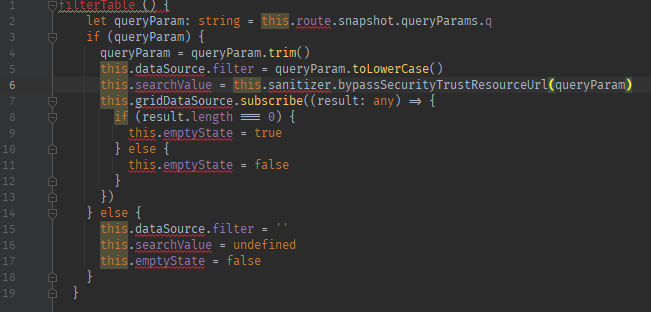
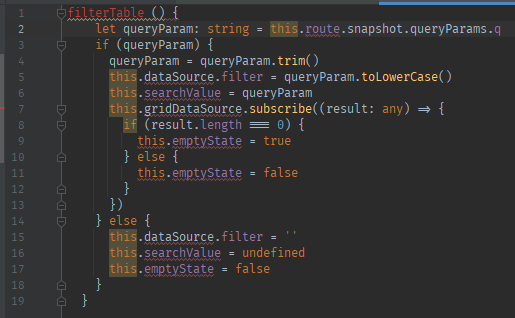
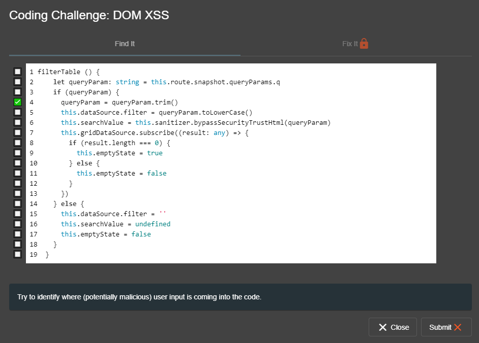
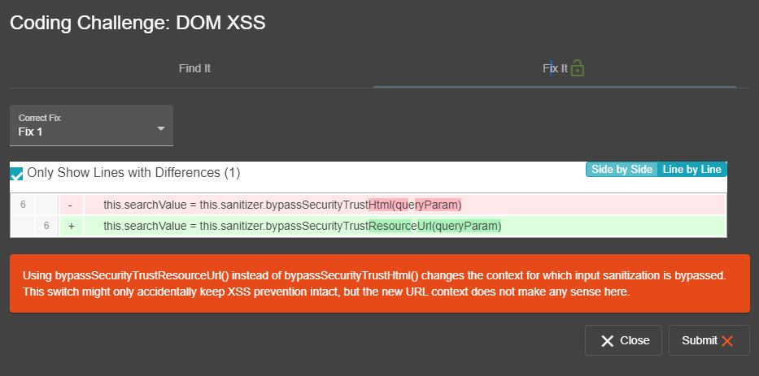
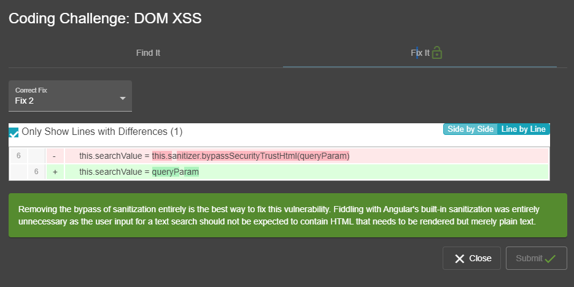

# Coding challenges

Starting with `v12.9.0`, OWASP Juice Shop offers a new developer-focused challenge for
some of its existing hacking challenges: Coding challenges. These were [briefly illustrated in Part 1 of this book](../part1/challenges.md#coding-challenges)
from a user's perspective. This appendix explains how a coding challenge can be added
to newly created hacking challenges.

Each coding challenge consists of two phases:

1. **Find It** where the user is tasked to select vulnerable line(s) of code in an actual code snippet from Juice Shop
2. **Fix It** where the user is presented with 3-4 options to choose from to fix that vulnerability and has to decide which one would be the best

## Vulnerable code snippets

Juice Shop allows associating its own vulnerable code with its own hacking challenges. To outfit new challenges with
such a code snippet, some conditions must be met, and a certain syntax for marking the code snippet have to be used.

### Supported source files

Juice Shop will perform a lookup for code snippets in these source files
or folders:

```
./server.ts
./routes
./lib
./data
./frontend/src/app
```

These are equally available when cloning the source code repo, running
the official Docker image or unpacking an official pre-packaged archive.

## `vuln-code-snippet` marker comments

All marker comments relevant for the code snippet processing start with
the `vuln-code-snippet` prefix followed by the type of marker, often
followed by the challenge key(s) the marker should be applied to.

| Marker Type  | Challenge Key(s) | Description                                                                                                            | Example                                                              |
|:-------------|:-----------------|:-----------------------------------------------------------------------------------------------------------------------|:---------------------------------------------------------------------|
| `start`      | Yes              | Beginning of a snippet for one or more challenges.                                                                     | `// vuln-code-snippet start localXssChallenge xssBonusChallenge`     |
| `end`        | Yes              | End of a snippet for one or more challenges.                                                                           | `// vuln-code-snippet end localXssChallenge xssBonusChallenge`       |
| `vuln-line`  | Yes              | Vulnerable code line for one or more challenges. Can appear multiple times within a corresponding `start`-`end` block. | `// vuln-code-snippet vuln-line localXssChallenge xssBonusChallenge` |
| `hide-line`  | No               | That particular line will be removed from all code snippets.                                                           | `// vuln-code-snippet hide-line`                                     |
| `hide-start` | No               | Beginning of a block that will be removed from all code snippets.                                                      | `// vuln-code-snippet hide-start`                                    |
| `hide-end`   | No               | End of a block that will be removed from all code snippets.                                                            | `// vuln-code-snippet hide-end`                                      |

Code snippet markers are recognized in any files as long as they support
a leading `//` or `#` for a single-line comment. This makes them usable
in TypeScript, JavaScript and YAML files, but not in HTML. Code markers
are only found in files residing in one of the above-mentioned folders.

#### Complete examples

##### TypeScript

The following code shows markers for two challenges with the same
vulnerable line, and a hidden code block:

```typescript
// vuln-code-snippet start localXssChallenge xssBonusChallenge
filterTable () {
let queryParam: string = this.route.snapshot.queryParams.q
if (queryParam) {
  queryParam = queryParam.trim()
  this.ngZone.runOutsideAngular(() => { // vuln-code-snippet hide-start
    this.io.socket().emit('verifyLocalXssChallenge', queryParam)
  }) // vuln-code-snippet hide-end
  this.dataSource.filter = queryParam.toLowerCase()
  this.searchValue = this.sanitizer.bypassSecurityTrustHtml(queryParam) // vuln-code-snippet vuln-line localXssChallenge xssBonusChallenge
  this.gridDataSource.subscribe((result: any) => {
    if (result.length === 0) {
      this.emptyState = true
    } else {
      this.emptyState = false
    }
  })
} else {
  this.dataSource.filter = ''
  this.searchValue = undefined
  this.emptyState = false
}
}
// vuln-code-snippet end localXssChallenge xssBonusChallenge
```

The next example explains how to mark one challenge with two vulnerable
lines, and some individually hidden lines:

```typescript
// vuln-code-snippet start fileWriteChallenge
function handleZipFileUpload ({ file }, res, next) {
  if (utils.endsWith(file.originalname.toLowerCase(), '.zip')) {
    if (file.buffer && !utils.disableOnContainerEnv()) { // vuln-code-snippet hide-line
      const buffer = file.buffer
      const filename = file.originalname.toLowerCase()
      const tempFile = path.join(os.tmpdir(), filename)
      fs.open(tempFile, 'w', function (err, fd) {
        if (err != null) { next(err) }
        fs.write(fd, buffer, 0, buffer.length, null, function (err) {
          if (err != null) { next(err) }
          fs.close(fd, function () {
            fs.createReadStream(tempFile)
              .pipe(unzipper.Parse()) // vuln-code-snippet vuln-line fileWriteChallenge
              .on('entry', function (entry) {
                const fileName = entry.path
                const absolutePath = path.resolve('uploads/complaints/' + fileName)
                utils.solveIf(challenges.fileWriteChallenge, () => { return absolutePath === path.resolve('ftp/legal.md') }) // vuln-code-snippet hide-line
                if (absolutePath.includes(path.resolve('.'))) {
                  entry.pipe(fs.createWriteStream('uploads/complaints/' + fileName).on('error', function (err) { next(err) })) // vuln-code-snippet vuln-line fileWriteChallenge
                } else {
                  entry.autodrain()
                }
              }).on('error', function (err) { next(err) })
          })
        })
      })
    } // vuln-code-snippet hide-line
    res.status(204).end()
  } else {
    next()
  }
}
// vuln-code-snippet end fileWriteChallenge
```

##### YAML

In this example, multiple challenges are defined in a shared code block
but each with their own vulnerable line:

```yaml
# vuln-code-snippet start resetPasswordBjoernOwaspChallenge resetPasswordBjoernChallenge resetPasswordJimChallenge resetPasswordBenderChallenge resetPasswordUvoginChallenge
-
  question: 'Your eldest siblings middle name?' # vuln-code-snippet vuln-line resetPasswordJimChallenge
-
  question: "Mother's maiden name?"
-
  question: "Mother's birth date? (MM/DD/YY)"
-
  question: "Father's birth date? (MM/DD/YY)"
-
  question: "Maternal grandmother's first name?"
-
  question: "Paternal grandmother's first name?"
-
  question: 'Name of your favorite pet?' # vuln-code-snippet vuln-line resetPasswordBjoernOwaspChallenge
-
  question: "Last name of dentist when you were a teenager? (Do not include 'Dr.')"
-
  question: 'Your ZIP/postal code when you were a teenager?' # vuln-code-snippet vuln-line resetPasswordBjoernChallenge
-
  question: 'Company you first work for as an adult?' # vuln-code-snippet vuln-line resetPasswordBenderChallenge
-
  question: 'Your favorite book?'
-
  question: 'Your favorite movie?' # vuln-code-snippet vuln-line resetPasswordUvoginChallenge
-
  question: 'Number of one of your customer or ID cards?'
-
  question: "What's your favorite place to go hiking?"
# vuln-code-snippet end resetPasswordBjoernOwaspChallenge resetPasswordBjoernChallenge resetPasswordJimChallenge resetPasswordBenderChallenge resetPasswordUvoginChallenge
```

#### Overlapping markers

After a code snippet has been retrieved and processed, all "dangling"
markers inside starting with `vuln-code-snippet` will be removed. This
allows to have overlapping `start` and `end` blocks for different
challenges that might share some but not all code.

### REST endpoints

The Score Board retrieves the actual code snippets via two REST
endpoints:

* `/snippets` returns the list of all challenge keys where code snippets
  are available in JSON format (e.g.
  `{"challenges":["directoryListingChallenge",...,"xssBonusChallenge"]}`)
* `/snippets/<challengeKey>` returns the actual code snippet plus the
  list of vulnerable lines in JSON format (e.g. `{"snippet":"filterTable
  () {\n let queryParam: string = ... }\n }","vulnLines":[6]}`)

#### Error handling

The following errors can occur when calling the REST endpoints:

| Endpoint                   | HTTP status code | Error                                                |
|:---------------------------|:-----------------|:-----------------------------------------------------|
| `/snippets/<challengeKey>` | `412`            | `Unknown challenge key: <challengeKey>`              |
| `/snippets/<challengeKey>` | `404`            | `No code snippet available for: <challengeKey>`      |
| `/snippets/<challengeKey>` | `422`            | `Broken code snippet boundaries for: <challengeKey>` |

#### Real-time retrieval

As the code snippets are retrieved in real-time from the actual code
base, all changes to the marker syntax while the application is running
are immediately applied and can be tested by re-opening the particular
snippet from the Score Board. Newly added code snippets are similarly
recognized by reloading the Score Board page. No frontend complation or
server restart is required.

## Fix option files

For the second stage of the Coding Challenges, users must by supplied with some code fix options to choose from.
The structural requirements here are very straightforward, it is rather the content that can get a bit difficult
depending on the complexity of the underlying vulnerability.

All fix option files have to be put into the folder `data/static/codefixes` and should have the same
file type as the original source file with the [vulnerability marker](#vuln-code-snippet-marker-comments).

For each coding challenge exactly one "correct" and two or more "wrong" option files must be provided.

### Naming conventions

The name of a fix option file must be either of the following:

* `<challengeKey>_<unique number>.<file suffix>` for "wrong" options
  * e.g. `localXssChallenge_1.ts`, `localXssChallenge_3.ts` and `localXssChallenge_4.ts`
* `<challengeKey>_<unique number>_correct.<file suffix>` for the "correct" option
  * e.g. `localXssChallenge_2_correct.ts`

### Fix option source

As the Coding Challenges rely on a code diff view it is crucial to avoid any accidental differences between the
original vulnerable code snippet and each fix option files.

This means that spacing, blank lines etc. need to be exactly the same. If for example the vulnerable
snippet is in a function that is indented by 4 spaces then the fix option source must be indented by 4 spaces as well.
As this would trigger many code linting errors, `npm run lint` will ignore the `data/static/codefixes` folder.

The following additional rules must be adhered to when creating fix option files:

* No indentation on the first line of the file
* No blank line at the end of the file
* Remove all `vuln-code-snippet` comments in [the exact same way](#vuln-code-snippet-marker-comments) the code snipper parser will

The recommended way to get properly formatted code fixing options, is to create one and copy it as many times
as total fix options should be provided, then performing the necessary changes to create a correct and several wrong
options from the source.

#### Vulnerable code snippet example


#### Wrong fix option example



#### Correct fix option example



### Maintenance burden

The downside of this implementation is a certain maintenance burden for Coding Challenges. When the
original source file is changed or refactored, the developer must keep in mind updating all fix option files
accordingly to prevent confusing differences. There is currently no automation in place to warn about this.

## Info YAML file

It is possible to provide hints and explanations for Coding Challenges via an optional YAML file. It needs
to follow the naming convention `<challengeKey>.info.yml` and be placed in `data/static/codefixes`. This file can
contain the following:

```yaml
fixes:
  - id: 1
    explanation: 'Explanation why fix option file #1 is right/wrong.'
  - id: 2
    explanation: 'Explanation why fix option file #2 is right/wrong.'
  - id: 3
    explanation: 'Explanation why fix option file #3 is right/wrong.'
  - id: 4
    explanation: 'Explanation why fix option file #4 is right/wrong.'
hints:
  - "Hint offered after 2nd failed 'Find It' attempt to submit the vulnerable line."
  - "Hint offered after 3nd failed 'Find It' attempt to submit the vulnerable line."
  - "Hint offered after 4th failed 'Find It' attempt to submit the vulnerable line."
```

### "Find It" hints

When the user submits wrongly selected vulnerable line(s) of code during
the "Find It" phase of a Coding Challenge, Juice Shop can display a hint to help them out.
This process starts after the second failed submission.



The hints will be picked in order of appearance in the `hints` list of the YAML info file.
One hint will be displayed at a time per submission attempt. It therefore makes sense to
have more vague hints at the top and more specific ones at the bottom of the `hints` list.
Although the number of hints that can be provided per coding challenge is not restricted,
the author recommends to have no less than 2 and no more than 5 hints on average.


Once all hints have been used up, Juice Shop will outright tell the user the correct answer, so they have a chance to proceed and not remain stuck infinitely.
This answer does not need to be provided in the `hints` list, as it will be generated on-the-fly by Juice Shop when needed.


### "Fix It" explanations

In the `fixes` list an explanation can be mapped to every available fix option of a Coding Challenge.
The `id` must be identical to the `unique nuber` part of a fix option file name `<challengeKey>_<unique number>.<file suffix>` in order to be loaded when appropriate.

The `explanation` should give a reason as to why a fix option is either correct or incorrect. The
explanation will be displayed after the user submitted a chosen fix option.



Other than with the hints for
finding the vulnerable line of code, the explanation is displayed independently of the verdict. Therefore, it
is important to also provide an explanation for the correct fix option.



### Info YAML file example

```yaml
fixes:
  - id: 1
    explanation: 'Using bypassSecurityTrustResourceUrl() instead of bypassSecurityTrustHtml() changes the context for which input sanitization is bypassed. This switch might only accidentally keep XSS prevention intact, but the new URL context does not make any sense here.'
  - id: 2
    explanation: "Removing the bypass of sanitization entirely is the best way to fix this vulnerability. Fiddling with Angular's built-in sanitization was entirely unnecessary as the user input for a text search should not be expected to contain HTML that needs to be rendered but merely plain text."
  - id: 3
    explanation: 'Using bypassSecurityTrustScript() instead of bypassSecurityTrustHtml() changes the context for which input sanitization is bypassed. If at all, this switch might only accidentally keep XSS prevention intact. The context where the parameter is used is not a script either, so this switch would be nonsensical.'
  - id: 4
    explanation: 'Using bypassSecurityTrustStyle() instead of bypassSecurityTrustHtml() changes the context for which input sanitization is bypassed. If at all, this switch might only accidentally keep XSS prevention intact. The context where the parameter is used is not CSS, making this switch totally pointless.'
hints:
  - "Try to identify where (potentially malicious) user input is coming into the code."
  - "What is the code doing with the user input other than using it to filter the data source?"
  - "Look for a line where the developers fiddled with Angular's built-in security model."
```

