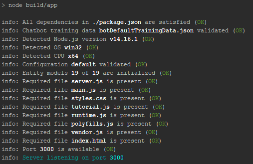
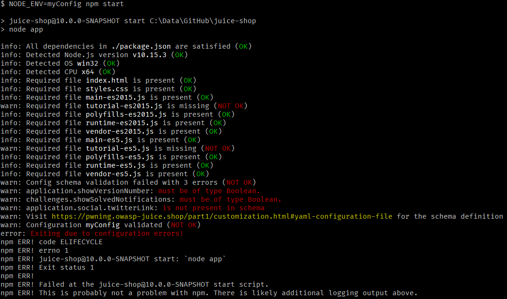

# Troubleshooting

If (and only if) none of the
[Common support issues](#common-support-issues) described below could
help resolve your issue, please ask for individual support on our
[official Gitter Chat](https://gitter.im/bkimminich/juice-shop). If you
are sure to have found a bug in the Juice Shop itself please
[open a 🐛 Bug report issue](https://github.com/bkimminich/juice-shop/issues/new?assignees=&labels=bug&template=bug-report.md&title=%5B%F0%9F%90%9B%5D+)
on GitHub.

🛑 _Please **do not** file questions or support requests on the GitHub
issues tracker._

## Start-up validations

During server start the Juice Shop runs a series of self-validations and
print feedback about their success to the console:

Juice Shop will resist to launch as long as any of these validations
fail:

The following checks are run during server startup and can typically be
fixed in a straightforward fashion when they fail:

| Validation error message                                                                                                             | Typical solution                                                                                                                                                                                                                                                                                                                                                        |
|:-------------------------------------------------------------------------------------------------------------------------------------|:------------------------------------------------------------------------------------------------------------------------------------------------------------------------------------------------------------------------------------------------------------------------------------------------------------------------------------------------------------------------|
| `Dependencies in ... could not be checked due to "..." error`                                                                        | Repair the mentioned dependency file. When using an original tag release version or `master` branch you should **never** see this error.                                                                                                                                                                                                                                |
| `Dependencies in ... are not rightly satisfied` followed by individual messages on missing dependencies or version mismatches        | If you installed [from sources](../part1/running.md#from-sources) re-run `npm install` and check for errors during that step. See also [Node.js / NPM](#nodejs--npm) for some common culprits. In a [pre-packaged distribution](../part1/running.md#from-pre-packaged-distribution) you should **never** see this error.                                                |
| `Detected Node version ... is not in the supported version range of ...`                                                             | Install one of the officially supported Node.js versions {{book.nodeVersions}}. If you use a [pre-packaged distribution](../part1/running.md#from-pre-packaged-distribution), make sure its version matches your installed Node.js version.                                                                                                                             |
| `Detected OS ... is not in the list of supported platforms ...`                                                                      | Make sure you use a supported operating system. If you use a [pre-packaged distribution](../part1/running.md#from-pre-packaged-distribution), make sure you downloaded the one for your OS.                                                                                                                                                                             |
| `Detected CPU ... is not in the list of supported architectures ...`                                                                 | Make sure you use a supported processor architecture. If you use a [pre-packaged distribution](../part1/running.md#from-pre-packaged-distribution), make sure you downloaded the one for your processor.                                                                                                                                                                |
| `Required file ... is missing`                                                                                                       | If you installed [from sources](../part1/running.md#from-sources) re-run `npm install` and check for errors during its final step `Generating ES5 bundles for differential loading...`. In a [pre-packaged distribution](../part1/running.md#from-pre-packaged-distribution) you should **never** see this error.                                                       |
| `Port ... is in use`                                                                                                                 | Make sure the port you intend to run Juice Shop on is actually available or use another port by setting the `PORT` environment variable.                                                                                                                                                                                                                                |
| `Config schema validation failed with ... errors` followed by individual messages on wrong property types or unrecognized properties | Make sure that your customization complies with the schema of the [YAML configuration file](../part1/customization.md#yaml-configuration-file).                                                                                                                                                                                                                         |
| `No product is configured as "..." challenge product but one is required`                                                            | Make sure that each property `useForChristmasSpecialChallenge`, `urlForProductTamperingChallenge`, `fileForRetrieveBlueprintChallenge` and `keywordsForPastebinDataLeakChallenge` (required for some of the challenges) is present on a single product in your custom inventory. See also [YAML configuration file](../part1/customization.md#yaml-configuration-file). |
| `Product ... is used as "..." challenge product and "..." challenge product but can only be used for one challenge`                  | Make sure no single product is associated with more than one property `useForChristmasSpecialChallenge`, `urlForProductTamperingChallenge`, `fileForRetrieveBlueprintChallenge` and `keywordsForPastebinDataLeakChallenge` in your custom inventory. See also [YAML configuration file](../part1/customization.md#yaml-configuration-file).                             |
| `Restricted tutorial mode is enabled while Hacking Instructor is disabled`                                                           | Make sure `hackingInstructor.isenabled` is `true` when you also have configured `challenges.restrictToTutorialsFirst` set to `true`.                                                                                                                                                                                                                                    |
| `CTF flags are enabled while challenge solved notifications are disabled`                                                            | Make sure `challenges.showSolvedNotifications` is `true` when you also have configured `ctf.showFlagsInNotifications` set to `true`.                                                                                                                                                                                                                                    |
| `CTF country mappings for FBCTF are enabled while CTF flags are disabled`                                                            | Make sure `ctf.showFlagsInNotifications` is `true` when you also have configured `ctf.showCountryDetailsInNotifications` set to `name`, `flag` or `both`.                                                                                                                                                                                                               |

If your installation did not even get to the point of running these
checks _or_ all checks successfully pass with `(OK)` but the application
still fails to start, please check the
[Common support issues](#common-support-issues) for possible hints to
solve your issue.

## Common support issues

The following issues have been seen (and solved/mitigated) more than
once and can hopefully help you to narrow down a solution for your
issue.

### Node.js / NPM

- After changing to a different Node.js version it is a good idea to
  delete `npm_modules` and re-install all dependencies from scratch with
  `npm install`
- If during `npm install` the `sqlite3` or `libxmljs2` binaries cannot
  be downloaded for your system, the setup falls back to building from
  source with `node-gyp`. Check the
  [`node-gyp` installation instructions](https://github.com/nodejs/node-gyp#installation)
  for additional tools you might need to install (e.g. Python 2.7, GCC,
  Visual C++ Build Tools etc.)
- If `npm install` runs into a `Unexpected end of JSON input` error you
  might need to clean your NPM cache with `npm cache clean --force` and
  then try again.

### Linux

- If `npm install` fails on Ubuntu with the pre-installed Node.js please
  install the latest release of Node.js {{book.recommendedNodeVersion}}
  from scratch and try again.
- If `npm install` on Linux runs into `WARN cannot run in wd` problems
  (e.g. during the frontend installation step) try running `npm install
  --unsafe-perm` instead.
- If `npm start` fails with `Error: ENOENT: no such file or directory,
  copyfile` you might have had either an error already during `npm
  install` _or_ you pulled changes from GitHub but did not re-run `npm
  install` afterwards. Make sure to check if the file to copy from
  exists on your disk and if the target folder for the copy is there.

### Docker

- If using Docker Toolbox on Windows make sure that you also enable port
  forwarding from Host `127.0.0.1:3000` to `0.0.0.0:3000` for TCP for
  the `default` VM in VirtualBox.

### SQLite

- If all startup checks show `(OK)` but you see `SequelizeDatabaseError:
  SQLITE_ERROR: no such table: <some table name>` errors right
  afterwards, please check if the file `data/juiceshop.sqlite` exists.
  If so just stop and restart your server and this suspected race
  condition issue shouid go away.

### Vagrant

- Using the Vagrant script (on Windows) might not work while your virus
  scanner is running. This problem was experienced at least with
  F-Secure Internet Security.

### OAuth

- If you are missing the _Login with Google_ button, you are running
  OWASP Juice Shop under an unrecognized URL. **You can still solve the
  OAuth related challenge!**
- If you want to manually make the OAuth integration work to get the
  full user experience, create your own customization file and define
  all properties in the
  [`googleOauth` subsection](../part1/customization.md#googleoauth-subsection)

### Miscellaneous

- You may find it easier to find vulnerabilities using a pen test tool.
  We strongly recommend
  [Zed Attack Proxy](https://code.google.com/p/zaproxy/) which is open
  source and very powerful, yet beginner friendly.

