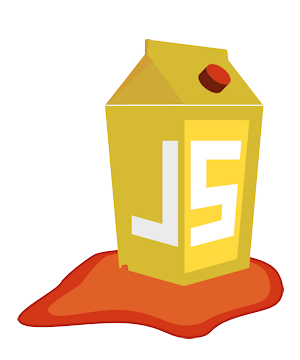

# Why the Juice Shop exists

To the unsuspecting user the Juice Shop just looks like a small online
shop which sells - _surprise!_ - fruit & vegetable juice and associated
products. Except for the entirely overrated payment and delivery aspect
of the e-commerce business, the Juice Shop is fully functional. But this
is just the tip of the iceberg. The Juice Shop contains
{{book.juiceShopNumberOfChallenges}} challenges of varying difficulty
where you are supposed to exploit underlying security vulnerabilities.
These vulnerabilities were intentionally planted in the application for
exactly that purpose, but in a way that actually happens in "real-life"
web development as well!

Your hacking progress is tracked by the application using immediate push
notifications for successful exploits as well as a score board for
progress overview. Finding this score board is actually one of the
(easiest) challenges! The idea behind this is to utilize
[gamification](https://en.wikipedia.org/wiki/Gamification) techniques to
motivate you to get as many challenges solved as possible - similar to
unlocking achievements in many modern video games.

Development of the Juice Shop started in September 2014 as the authors
personal initiative, when a more modern exercise environment for an
in-house web application security training for his employer was needed.
The previously used exercise environment was still from the server-side
rendered ASP/JSP/Servlet era and did not reflect the reality of current
web technology any more. The Juice Shop was developed as open-source
software without any corporate branding right from the beginning. Until
end of 2014 most of the current e-commerce functionality was up and
running - along with an initial number of planted vulnerabilities. Over
the years more variants of vulnerabilities were added. In parallel the
application was kept up-to-date with latest web technology (e.g.
WebSockets and OAuth 2.0) and frontend frameworks (i.e. by migrating
from AngularJS with Bootstrap to Angular with Material Design). Some of
these additional capabilities then brought the chance to add
corresponding vulnerabilities - and so the list of challenges kept
growing ever since.

Apart from the hacker and awareness training use case, penetration
testing tools and automated security scanners are invited to use Juice
Shop as a sort of guinea pig-application to check how well their
products cope with JavaScript-heavy application frontends and REST APIs.

### Why _OWASP_ Juice Shop?

> Every vibrant technology marketplace needs an unbiased source of
> information on best practices as well as an active body advocating
> open standards. In the Application Security space, one of those groups
> is the Open Web Application Security Project (or OWASP for short).
>
> The Open Web Application Security Project (OWASP) is a 501(c)(3)
> worldwide not-for-profit charitable organization focused on improving
> the security of software. Our mission is to make software security
> visible, so that individuals and organizations are able to make
> informed decisions. OWASP is in a unique position to provide
> impartial, practical information about AppSec to individuals,
> corporations, universities, government agencies and other
> organizations worldwide. Operating as a community of like-minded
> professionals, OWASP issues software tools and knowledge-based
> documentation on application security.[^1]

Two years after its inception the Juice Shop was submitted and accepted
as an _OWASP Tool Project_ by the
[Open Web Application Security Project](https://owasp.org) in September
2016\. This move increased the overall visibility and outreach of the
project significantly, as it exposed it to a large community of
application security practitioners.

Once in the OWASP project portfolio it took only eight months until
Juice Shop was promoted from the initial _Incubator_ maturity level to
_Lab Projects_ level. End of July 2018 the Juice Shop was promoted into
the final _Flagship_ maturity stage for OWASP projects.

### Why the name "Juice Shop"?

In German there is a dedicated word for _dump_, i.e. a store that sells
lousy wares and does not exactly have customer satisfaction as a
priority: _Saftladen_. Reverse-translating this separately as _Saft_ and
_Laden_ yields _juice_ and _shop_ in English. That is where the project
name comes from. The fact that the initials _JS_ match with those
commonly used for _JavaScript_ was purely coincidental and not related
to the choice of implementation technology.

### Why the logo?

Other than the name, the Juice Shop logo was designed explicitly with
_JavaScript_ in mind:

The authors idea was to convert one of the (unofficial but popular)
_JavaScript_ shield-logos into a **leaking juice box** because it had a
quite matching shape for this shenanigans:

In 2017 the logo received a facelift and a spin-off when the Juice Shop
introduced its Capture-the-flag extension (which is discussed in its own
chapter [Hosting a CTF event](../part1/ctf.md)):

### Why yet another vulnerable web application?

A considerable number of vulnerable web applications already existed
before the Juice Shop was created. The
[OWASP Vulnerable Web Applications Directory (VWAD)](https://wiki.owasp.org/index.php/OWASP_Vulnerable_Web_Applications_Directory_Project)
maintains a list of these applications. When Juice Shop came to life
there were only _server-side rendered_ applications in the VWAD. But
_Rich Internet Application (RIA)_ or _Single Page Application (SPA)_
style applications were already a commodity at that time. Juice Shop was
meant to fill that gap.

Many of the existing vulnerable web applications were very rudimental in
their functional scope. So the aim of the Juice Shop also was to give
the impression of a functionally complete e-commerce application that
could actually exist like this in the wild.

[^1]: https://wiki.owasp.org
