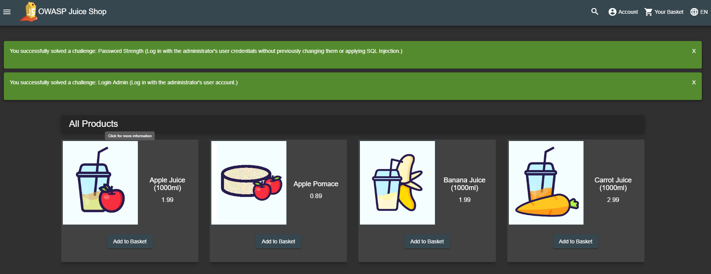
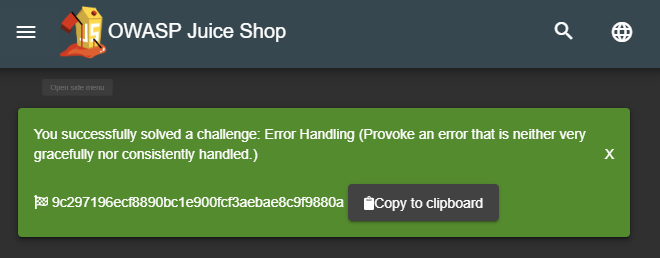
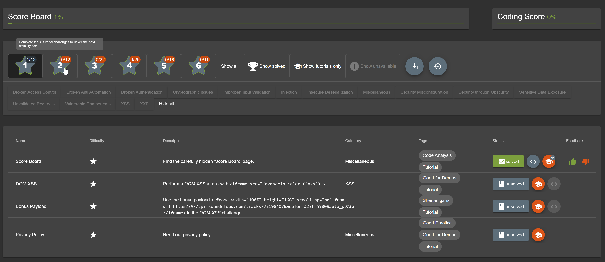
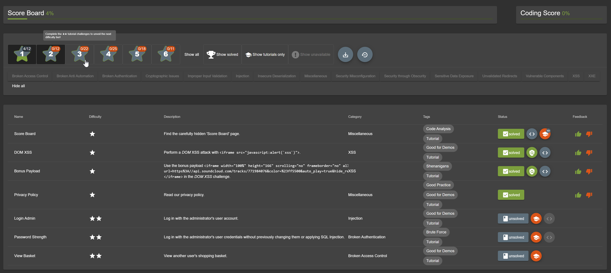
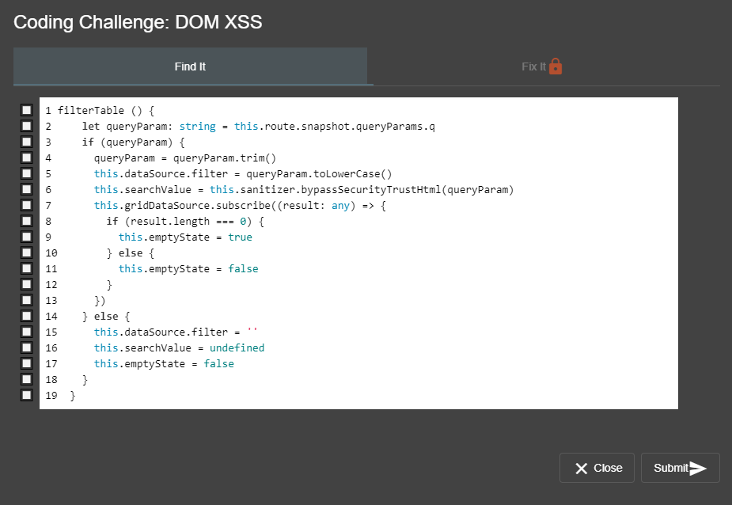
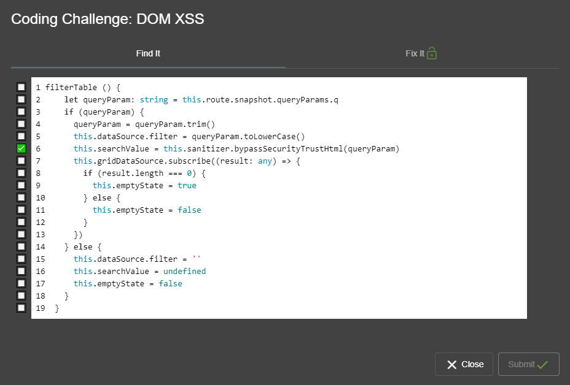

# Challenge tracking

## The Score Board

In order to motivate you to hunt for vulnerabilities, it makes sense to
give you at least an idea what challenges are available in the
application. Also, you should know when you actually solved a challenge
successfully, so you can move on to another task. Both these cases are
covered by the application's score board.

On the score board you can view a list of all available challenges with
a brief description. Some descriptions are _very explicit_ hacking
instructions. Others are just _vague hints_ that leave it up to you to
find out what needs to be done.


The challenges are rated with a difficulty level between ⭐ and
⭐⭐⭐⭐⭐⭐, with more stars representing a higher difficulty. To make the
list of challenges less daunting, they are clustered by difficulty. By
default, only the 1-star challenges are unfolded. You can open or
collapse all challenge blocks as you like. Collapsing a block has _no
impact_ on whether you can _solve_ any of its challenges.

The difficulty ratings have been continually adjusted over time based on
user feedback. The ratings allow you to manage your own hacking pace and
learning curve significantly. When you pick a 5- or 6-star challenge you
should _expect_ a real challenge and should be less frustrated if you
fail on it several times. On the other hand if hacking a 1- or 2-star
challenge takes very long, you might realize quickly that you are on a
wrong track with your chosen hacking approach.

Finally, each challenge states if it is currently _unsolved_ or
_solved_. The current overall progress is represented in a progress bar
on top of the score board. Especially in group hacking sessions this
allows for a bit of competition between the participants.

If not deliberately turned off (see [Customization](customization.md))
you can hover over each _unsolved_ label to see a hint for that
challenge. If a "book" icon is also displayed within the label, you can
click on it to be redirected to the corresponding hints section in
[Part 2](../part2/README.md) of this book.

### Challenge Filters

Additional to the filtering by difficulty, you can filter the Score
Board by [challenge categories](categories.md), e.g. to focus your
hacking efforts on specific vulnerabilities. You can also hide all
solved challenges to reduce the level of distraction on the Score Board.

🐌 Selecting _Show all_ for all difficulties and all challenges might
impact the load time of the Score Board significantly!

### Challenge Tags

Starting with `v12.0.0` tags were introduced to help classify challenges
which either favor a certain hacking approach or share some trait
orthogonal to the categories.

* **Shenanigans** marks challenges which are not considered serious
  and/or realistic but exist more for entertainment
* **Contraption** indicates that a challenge is not exactly part of a
  realistic scenario but might be a bit forced or crafted
* **OSINT** marks challenges which require some Internet research or
  _social stalking_ activity outside the application
* **Good Practice** highlights challenges which are less about
  vulnerabilities but promoting good (security) practices
* **Danger Zone** marks
  [potentially dangerous challenges](#potentially-dangerous-challenges)
  which are disabled on Docker/Heroku by default due to RCE or other
  risks
* **Good for Demos** highlights
  [challenges which are suitable for live demos](../appendix/trainers.md#challenges-for-demos)
  or awareness trainings
* **Prerequisite** marks challenges which need to be solved before one
  or more other challenges can be (realistically) solved
* **Brute Force** marks challenges where automation of some security
  tool or custom script is an option or even prerequisite
* **Tutorial** marks challenges for which a
  [Hacking Instructor script](#hacking-instructor) exists to assist
  newcomers
* **Code Analysis** marks challenges where it can be helpful to rummage
  through some source code of the application or that of a third party

## Success notifications

The OWASP Juice Shop employs a simple yet powerful gamification
mechanism: Instant success feedback! Whenever you solve a hacking
challenge, a notification is _immediately_ shown on the user interface.



This feature makes it unnecessary to switch back and forth between the
screen you are attacking, and the score board to verify if you
succeeded. Some challenges will force you to perform an attack outside
of the Juice Shop web interface, e.g. by interacting with the REST API
directly. In these cases the success notification will light up when you
come back to the regular web UI the next time.

To make sure you do not miss any notifications they do not disappear
automatically after a timeout. You have to dismiss them explicitly. In
case a number of notifications "piled up" it is not necessary to dismiss
each one individually, as you can simply `Shift`-click one of their
_X_-buttons to dismiss all at the same time.

Depending on your application configuration, each challenge notification
might also show a 🏁 symbol with a character sequence next to it. If you
are doing a hacking session just on your own, you can completely ignore
this flag. The code is only relevant if you are participating in a CTF
event. Please refer to chapter [Hosting a CTF event](ctf.md) for more
information this topic.



## Automatic saving and restoring hacking progress

The [_self-healing_ feature](running.md#self-healing-feature) - by
wiping the entire database on server start - of Juice Shop was
advertised as a benefit just a few pages before. This feature comes at a
cost, though: As the challenges are also part of the database schema,
they will be wiped along with all the other data. This means, that after
every restart you start with a clean 0% score board and all challenges
in _unsolved_ state.

To keep the resilience against data corruption but allow users to _pick
up where they left off_ after a server restart, your hacking progress is
automatically saved whenever you solve a challenge - as long as you
allow Browser cookies!

After restarting the server, once you visit the application your hacking
progress is automatically restored:


The auto-save mechanism keeps your progress for up to 30 days after your
previous hacking session. When the score board is restored to its prior
state, a torrent of success notifications will light up - depending on
how many challenges you solved up to that point. As mentioned earlier
these can be bulk-dismissed by `Shift`-clicking any of the _X_-buttons.

If you want to start over with a fresh hacking session, simply click the
_Delete cookie to clear hacking progress_ button. After the next server
restart, your score board will be blank.

## Manual progress and settings backup

With the round _Backup_ and _Restore_ buttons on the Score Board you can
save and later restore your hacking progress as well as language, Score
Board filters, banner dismissal to a `JSON` file.


The backup format is independent of your system or browser, meaning you
can use the backup file to conveniently transfer your progress and
settings from one computer to another. Example:

```json
{
  "version": 1,
  "scoreBoard": {
    "displayedDifficulties": [ 1, 2, 3 ],
    "displayedChallengeCategories": [
      "Broken Access Control",
      "Broken Anti Automation"
    ]
  },
  "banners": {
    "welcomeBannerStatus": "dismiss",
    "cookieConsentStatus": "dismiss"
  },
  "language": "de_DE",
  "continueCode": "rzJBXpa...bm45J2okY7LX4v7o"
}
```

When the backup restore is successful, you must click "Apply changes
now" in the corresponding message to trigger the hacking progress
restore as well as the language changes in backend data.


If you do not click that button before the message vanishes, you can
also restart your application server to apply the backup of hacking
progress.

If during restore you see an error message `Version X is incompatible
with expected version Y` your backup was taken before a semantically
incompatible format change. The current backup schema version is
{{book.backupSchemaVersion}}.



## Hacking Instructor


The built-in _Hacking Instructor_ offers tutorials for some Juice Shop
challenges. By default, the welcome banner shown upon first launch of
the application has a 🎓-button which will help you
[Find the carefully hidden 'Score Board' page](../part2/score-board.md#find-the-carefully-hidden-score-board-page).


On the Score Board itself you will then find similar 🎓-buttons on some
challenges which will launch a corresponding tutorial for each as well.
All tutorials consist of a scripted sequence of helpful hints and
instructions.


The scripts often provide some interaction, like waiting for the user to
make some specific input or having them visit another dialog before
continuing. Some hints or instructions can be skipped by just clicking
on them.


After successfully completing all steps of a tutorial, the Hacking
Instructor will usually congratulate you and then go into hiding until
summoned again for another hacking challenge via the Score Board.


ℹ️ The Hacking Instructor is a tool to help beginners getting started.
It cannot offer a tutorial for _every challenge_ as some are too complex
or require too many steps outside the application. In Part III you can
learn more about how to write
[Hacking Instructor tutorial scripts](../part3/tutorials.md).

### Tutorial mode

When using the Juice Shop in a classroom setup the trainer or teacher
might want to set a slower pace at the beginning to give everyone a
chance to get familiar with the application. Here the `tutorial.yml`
configuration can be very useful, which is available since `v10.2.0` of
Juice Shop. This mode hides all challenges without tutorials from the
Score Board and disables all advanced filter options. In the tutorial
mode challenges are only gradually unlocked by difficulty tiers.



Only when for example all 1-star challenges with a tutorial have been
solved, the 2-star challenges with tutorials are displayed:



After solving **all** challenges with tutorials, the entire Score Board
with all challenges is shown and all filters are enabled. Passing in the
`NODE_ENV=tutorial` environment variable will activate this mode.


## Vulnerable code snippets

For many (solved) challenges an additional button is displayed on the
Score Board which  
will open a dialog containing the actual code snippet responsible for
the vulnerability.


This snippet is loaded in real-time from the running application's
actual code base and is sanitized to not show any "challenge check" or
similar code that would not be present in a real-world application.



The user can try to identify the actually line(s) of code responsible
for the vulnerability behind the particular challenge. To verify their
deduction, they can simply hover over the spoiler badge below the
snippet, to reveal those line numbers.





## Mitigation links

For many solved challenges links to mitigation techniques are presented
on the Score Board. Where available they typically lead to a
corresponding [OWASP Cheat Sheet](https://cheatsheetseries.owasp.org/)
explaining how to avoid that kind of vulnerability in the first place.


## Potentially dangerous challenges

Some challenges can cause potential harm or pose some danger for your
computer, i.e. the XXE, SSTi and Deserialization challenges as well as
two of the NoSQLi challenges, and the possibility of an arbitrary file
write. These simply cannot be sandboxed in a 100% secure way. These are
only dangerous if you use actually malicious payloads, so please do not
play with payloads you do not fully understand. Furthermore, be aware
all stored XSS vulnerabilities can - by their nature - be abused to
perform harmful attacks on unsuspecting visitors.

For safety reasons all potentially dangerous challenges are disabled
(along with their underlying vulnerabilities) in containerized
environments. By default, this applies to Docker and Heroku. These
challenges are marked as 'unavailable' in the scoreboard as can be seen
in the screenshot above.

To re-enable all challenges you can set the environment variable
`NODE_ENV=unsafe`, or you can set `safetyOverride: true` in your own
[YAML configuration file](customization.md#yaml-configuration-file).
Please use the unsafe mode at your own risk, especially on publicly
hosted instances.
