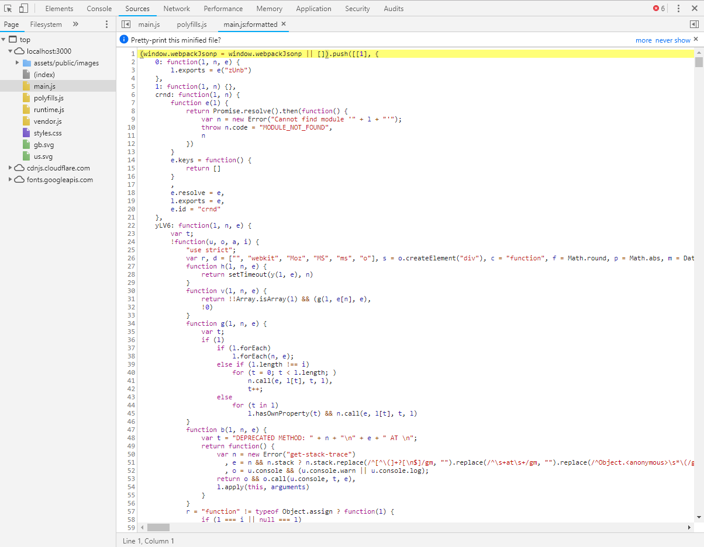
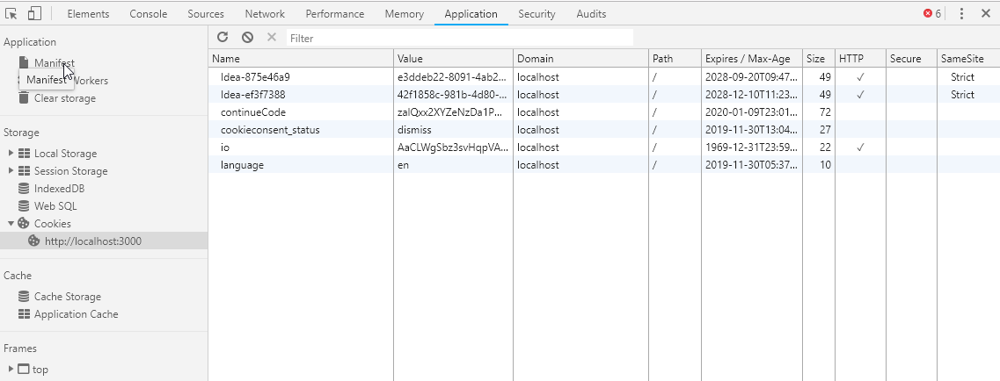
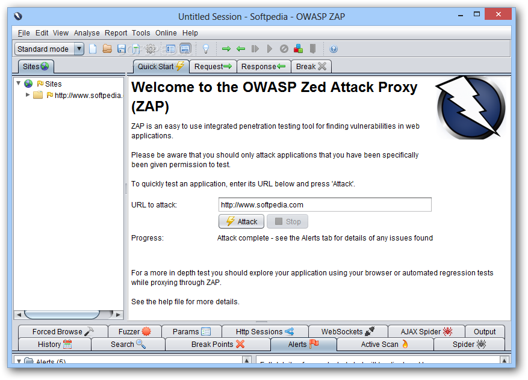

# Hacking exercise rules

## ✔️ Recommended hacking tools

### Browser

When hacking a web application a good internet browser is mandatory. The
emphasis lies on _good_ here, so you do _not_ want to use Internet
Explorer. Other than that it is up to your personal preference. Chrome
and Firefox both work fine from the authors experience.

#### Browser development toolkits

When choosing a browser to work with you want to pick one with good
integrated (or pluggable) developer tooling. Google Chrome and Mozilla
Firefox both come with powerful built-in _DevTools_ which you can open
via the `F12`-key.

When hacking a web application that relies heavily on JavaScript, **it
is essential to your success to monitor the _JavaScript Console_
permanently!** It might leak valuable information to you through error
or debugging logs!

Other useful features of browser DevTools are their network overview as
well as insight into the client-side JavaScript code, cookies and other
local storage being used by the application.

You can find a comprehensive list of useful browser features for hacking
endeavors at
[Web app security testing with browsers](https://getmantra.com/web-app-security-testing-with-browsers/).
Take a look at the
[Support Matrix](https://getmantra.com/web-app-security-testing-with-browsers/#thematrix)
to get an overview of the capabilities offered by different popular
browsers. Spoiler alert: Mozilla Firefox is your best friend as an
entry-level hacking tool!

| Function                   | Google Chrome | Mozilla Firefox | Edge/IE | Safari |
|:---------------------------|:--------------|:----------------|:--------|:-------|
| Switching User Agents      | ✔             | ✔              | ✔       | ✔     |
| Edit and Replay Requests   | ✖             | ✔              | ✖       | ✖     |
| Editing Cookies            | ✔             | ✔              | ✔       | ✖     |
| Editing Local Storage      | ✔             | ✔              | ✔       | ✖     |
| Disable CSS                | ✔             | ✔              | ✔       | ✔     |
| Disable Javascript         | ✔             | ✔              | ✖       | ✔     |
| View Headers               | ✔             | ✔              | ✔       | ✔     |
| Native screen-shot capture | ✔             | ✔              | ✔       | ✖     |
| Offline mode               | ✔             | ✔              | ✖       | ✖     |
| Encode and Decode          | ✔             | ✔              | ✔       | ✔     |

#### Tools for HTTP request tampering

[Tamper Chrome](https://chrome.google.com/webstore/detail/tamper-chrome-extension/hifhgpdkfodlpnlmlnmhchnkepplebkb)
lets you monitor and - more importantly - modify HTTP requests _before_
they are submitted from the browser to the server.

Mozilla Firefox has built-in tampering capabilities and does not need a
plugin. On the _Network_ tab of Firefox's DevTools you have the option
to _Edit and Resend_ every recorded HTTP request.

Tampering is extremely useful when probing for holes in the server-side
validation logic. It can also be helpful when trying to bypass certain
input validation or access restriction mechanisms, that are not properly
checked _on the server_ once more.

An API testing plugin like
[PostMan](https://chrome.google.com/webstore/detail/postman/fhbjgbiflinjbdggehcddcbncdddomop)
for Chrome allows you to communicate with the RESTful backend of a web
application directly. Skipping the UI can often be useful to circumvent
client-side security mechanisms or simply get certain tasks done faster.
Here you can create requests for all available HTTP verbs (`GET`,
`POST`, `PUT`, `DELETE` etc.) with all kinds of content-types, request
headers etc.

If you feel more at home on the command line, `curl` will do the trick
just as fine as the recommended browser plugins.

#### Scripting tools

A small number of challenges is not realistically solvable manually
unless you are cheating or are incredibly 🍀-lucky.

For these challenges you will require to write some scripts that for
example can submit requests with different parameter values
automatically in a short time. As long as the tool or language of choice
can submit HTTP requests, you should be fine. Use whatever you are most
familiar with.

If you have little experience in programming, best pick a language that
is easy to get into and will give you results without forcing you to
learn a lot of syntax elements or write much _boilerplate code_. Python,
Ruby or JavaScript give you this simplicity and ease-of-use. If you
consider yourself a "command-line hero", Bash or PowerShell will get the
job done for you. Languages like Java, C# or Perl are probably less
suitable for beginners. In the end it depends entirely on your
preferences, but being familiar with at least one programming language
is kind of mandatory if you want to get 100% on the score board.

> In computer programming, boilerplate code or boilerplate refers to
> sections of code that have to be included in many places with little
> or no alteration. It is often used when referring to languages that
> are considered verbose, i.e. the programmer must write a lot of code
> to do minimal jobs.[^1]

### Penetration testing tools

You _can_ solve all challenges just using a browser and the
plugins/tools mentioned above. If you are new to web application hacking
(or penetration testing in general) this is also the _recommended_ set
of tools to start with. In case you have experience with professional
pentesting tools, you are free to use those! And you are _completely
free_ in your choice, so expensive commercial products are just as fine
as open source tools. With this kind of tooling you will have a
competitive advantage for some of the challenges, especially those where
_brute force_ is a viable attack. But there are just as many
multi-staged vulnerabilities in the OWASP Juice Shop where - at the time
of this writing - automated tools would probably not help you at all.

In the following sections you find some recommended pentesting tools in
case you want to try one. Please be aware that the tools are not trivial
to learn - let alone master. Trying to learn about the web application
security basics _and_ hacking tools _at the same time_ is unlikely to
get you very far in either of the two topics.

#### Intercepting proxies

An intercepting proxy is a software that is set up as _man in the
middle_ between your browser and the application you want to attack. It
monitors and analyzes all the HTTP traffic and typically lets you
tamper, replay and fuzz HTTP requests in various ways. These tools come
with lots of attack patterns built in and offer active as well as
passive attacks that can be scripted automatically or while you are
surfing the target application.

The open-source [OWASP Zed Attack Proxy (ZAP)](https://www.zaproxy.org/)
is such a software and offers many useful hacking tools for free:

> ZAP is an easy to use integrated penetration testing tool for finding
> vulnerabilities in web applications. It is designed to be used by
> people with a wide range of security experience and as such is ideal
> for developers and functional testers who are new to penetration
> testing. ZAP provides automated scanners as well as a set of tools
> that allow you to find security vulnerabilities manually.[^2]

#### Pentesting Linux distributions

Instead of installing a tool such as ZAP on your computer, why not take
it, add _several hundred_ of other offensive security tools and put them
all into a ready-to-use Linux distribution? Entering
[Kali Linux](https://www.kali.org) and similar toolboxes:

> Kali Linux is a Debian-based Linux distribution aimed at advanced
> Penetration Testing and Security Auditing. Kali contains several
> hundred tools aimed at various information security tasks, such as
> Penetration Testing, Forensics and Reverse Engineering.[^3]

The keyword in the previous quote is _advanced_! More precisely, Kali
Linux is _easily overwhelming_ when beginners try to work with it, as
even the Kali development team states:

> As the distribution’s developers, you might expect us to recommend
> that everyone should be using Kali Linux. The fact of the matter is,
> however, that Kali is a Linux distribution specifically geared towards
> professional penetration testers and security specialists, and given
> its unique nature, it is __NOT__ a recommended distribution if you’re
> unfamiliar with Linux \[...\]. Even for experienced Linux users, Kali
> can pose some challenges.[^4]

Although there exist some more light-weight pentesting distributions,
they basically still present a high hurdle for people new to the IT
security field. If you still feel up to it, give Kali Linux a try!

### Internet

You are free to use Google during your hacking session to find helpful
websites or tools. The OWASP Juice Shop is leaking useful information
all over the place if you know where to look, but sometimes you simply
need to extend your research to the Internet in order to gain some
relevant piece of intel to beat a challenge.

## 💡 Getting hints

Frankly speaking, you are reading the _premium source of hints_ right
now! Congratulations! In case you want to hack more on your own than
[follow the breadcrumbs through the wood of challenges in part II](../part2/README.md),
the most direct way to ask for specific hints for a particular challenge
is the community chat on Gitter.im at
<https://gitter.im/bkimminich/juice-shop>. You can simply log in to
Gitter with your GitHub account.

If you prefer, you can also use the project's Slack channel at
<https://owasp.slack.com/messages/project-juiceshop>. You just need to
self-invite you to OWASP's Slack first at
<https://owasp-slack.herokuapp.com>. If you like it a bit more
nostalgic, you can also join and post to the project Google
group/mailing list at
<https://groups.google.com/a/owasp.org/forum/#!forum/juice-shop-project>.

## ❌ Things considered cheating



### Reading a solution ( 📕 ) before trying

The [Challenge solutions](../appendix/solutions.md) appendix is there to
help you in case you are stuck or have absolutely no idea how a specific
challenge is solved. Simply going through the entire appendix back to
back and follow the step-by-step instructions given there for each
challenge, would deprive you of most of the fun and learning effect of
the Juice Shop. You have been warned.



### Source code

Juice Shop is supposed to be attacked in a "black box" manner. That
means you cannot look into the source code to search for
vulnerabilities. As the application tracks your successful attacks on
its challenges, the code must contain checks to verify if you succeeded.
These checks would give many solutions away immediately.

The same goes for several other implementation details, where
vulnerabilities were arbitrarily programmed into the application. These
would be obvious when the source code is reviewed.

Finally the end-to-end test suite of Juice Shop was built hack all
challenges automatically, in order to verify they can all be solved.
These tests deliver all the required attacks on a silver plate when
reviewed.

### GitHub repository

While stated earlier that "the Internet" is fine as a helpful resource,
consider the GitHub repository https://github.com/juice-shop/juice-shop
as entirely off limits. First and foremost because it contains the
source code (see above).

Additionally it hosts the issue tracker of the project, which is used
for idea management and task planning as well as bug tracking. You can
of course submit an issue if you run into technical problems that are
not covered by the [Troubleshooting section of the README.md](). You
just should not read issues labelled `challenge` as they might contain
spoilers or solutions.

Of course you are explicitly allowed to view
[the repository's README.md page](https://github.com/juice-shop/juice-shop/blob/master/README.md),
which contains no spoilers but merely covers project introduction, setup
and troubleshooting. Just do not "dig deeper" than that into the
repository files and folders.

### Database table `Challenges`

The challenges (and their progress) live in one database together with
the rest of the application data, namely in the `Challenges` table. Of
course you could "cheat" by simply editing the state of each challenge
from _unsolved_ to _solved_ by setting the corresponding `solved` column
to `1`. You then just have to keep your fingers crossed, that nobody
ever asks you to _demonstrate how_ you actually solved all the 4- and
5-star challenges so quickly.

### Configuration REST API Endpoint

The Juice Shop offers a URL to retrieve configuration information which
is required by the [Customization](customization.md) feature that allows
redressing the UI and overwriting the product catalog:
<http://localhost:3000/rest/admin/application-configuration>

The returned JSON contains spoilers for all challenges that depend on a
product from the inventory which might be customized. As not all
customization can be prepared on the server side, exposing this REST
endpoint is unavoidable for the [Customization](customization.md)
feature to work properly.

### Tutorial JavaScript file

If enabled, the
[Hacking Instructor](../part1/challenges.md#hacking-instructor) script
`tutorial.js` including
all on-screen tutorials is loaded lazily by the _Score Board_ and the
_Welcome Banner_. You should exclude this file from all your manual or
automated frontend code analysis. It contains step-by-step hints and
unavoidably massive spoilers for several challenges via its condition
checks that trigger progressing through each tutorial.

### Score Board HTML/CSS

The Score Board and its features were covered in the
[Challenge tracking](challenges.md) chapter. In the current context of
"things you should not use" suffice it to say, that you could manipulate
the score board in the web browser to make challenges _appear as
solved_. Please be aware that this "cheat" is even easier (and more
embarrassing) to uncover in a classroom training than the previously
mentioned database manipulation: A simple reload of the score board URL
will let all your local CSS changes vanish in a blink and reveal your
_real_ hacking progress.

[^1]: https://en.wikipedia.org/wiki/Boilerplate_code

[^2]: https://github.com/zaproxy/zap-core-help/wiki

[^3]: http://docs.kali.org/introduction/what-is-kali-linux

[^4]: http://docs.kali.org/introduction/should-i-use-kali-linux

