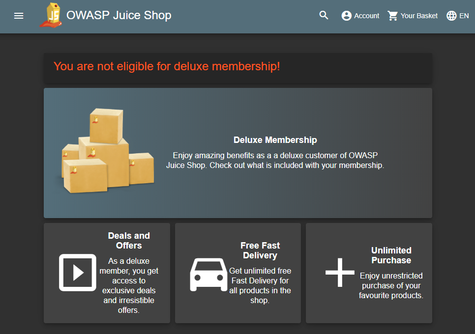

# Security Misconfiguration

## Challenges covered in this chapter

| Name                 | Description                                                                                                  | Difficulty |
|:---------------------|:-------------------------------------------------------------------------------------------------------------|:-----------|
| Cross-Site Imaging   | Stick cute cross-domain kittens all over our delivery boxes.                                                 | ⭐⭐⭐⭐⭐   |
| Deprecated Interface | Use a deprecated B2B interface that was not properly shut down.                                              | ⭐⭐        |
| Error Handling       | Provoke an error that is neither very gracefully nor consistently handled.                                   | ⭐         |
| Login Support Team   | Log in with the support team's original user credentials without applying SQL Injection or any other bypass. | ⭐⭐⭐⭐⭐⭐  |

### Stick cute cross-domain kittens all over our delivery boxes

The Juice Shop offers a _Deluxe Membership_ that comes with reduced
delivery fees and other perks. On the page advertising it, a heap of
delivery boxes can be seen - all with the Juice Shop logo on them.

* Loading this page with an empty browser cache and on a slow (or
  throttled) connection will give you an idea on what the delivery box
  image is made of. Of course inspecting the page source will tell you
  just as much.
* You need to dive deep into the actual Angular code to understand this
  one.
* This challenge requires the exploitation of another vulnerability
  which even has its own two challenges in its very own category
* This challenge can only be solved by strictly using the mentioned
  "cross-domain kittens". No other kittens from anywhere else can solve
  this challenge.

### Use a deprecated B2B interface that was not properly shut down

The Juice Shop represents a classic Business-to-Consumer (B2C)
application, but it also has some enterprise customers for which it
would be inconvenient to order large quantities of juice through the
webshop UI. For those customers there is a dedicated B2B interface.

* The old B2B interface was replaced with a more modern version
  recently.
* When deprecating the old interface, not all of its parts were cleanly
  removed from the code base.
* Simply using the deprecated interface suffices to solve this
  challenge. No attack or exploit is necessary.

### Provoke an error that is neither very gracefully nor consistently handled

The OWASP Juice Shop is quite _forgiving_ when it comes to bad input,
broken requests or other failure situations. It is just not very
sophisticated at _handling_ errors properly. You can harvest a lot of
interesting information from error messages that contain too much
information. Sometimes you will even see error messages that should not
be visible at all.

> Applications can unintentionally leak information about their
> configuration, internal workings, or violate privacy through a variety
> of application problems. Applications can also leak internal state via
> how long they take to process certain operations or via different
> responses to differing inputs, such as displaying the same error text
> with different error numbers. Web applications will often leak
> information about their internal state through detailed or debug error
> messages. Often, this information can be leveraged to launch or even
> automate more powerful attacks.[^1]

* This challenge actually triggers from various possible error
  conditions.
* You can try to submit bad input to forms to provoke an improper error
  handling
* Tampering with URL paths or parameters might also trigger an
  unforeseen error

If you see the success notification for this challenge but no error
message on screen, the error was probably logged on the JavaScript
console of the browser. You were supposed to have it open all the time
anyway, remember?

### Log in with the support team's original user credentials

This is another _follow-the-breadcrumbs_ challenge of the tougher sort.
As a little background story, imagine that the OWASP Juice Shop was
developed in the _classic style_: The development team wrote the code
and then threw it over the fence to an operations and support team to
run and troubleshoot the application. Not the slightest sign of
[DevOps](https://en.wikipedia.org/wiki/DevOps) culture here.

* The support team is located in some low-cost country and the team
  structure fluctuates a lot due to people leaving for jobs with even
  just slightly better wages.
* To prevent abuse the password for the support team account is very
  strong.
* To allow easy access during an incident, the support team utilizes a
  3rd party tool which every support engineer can access to get the
  current account password from.
* While it is also possible to use SQL Injection to log in as the
  support team, this will not solve the challenge.

[^1]: https://wiki.owasp.org/index.php/Top_10_2007-Information_Leakage
