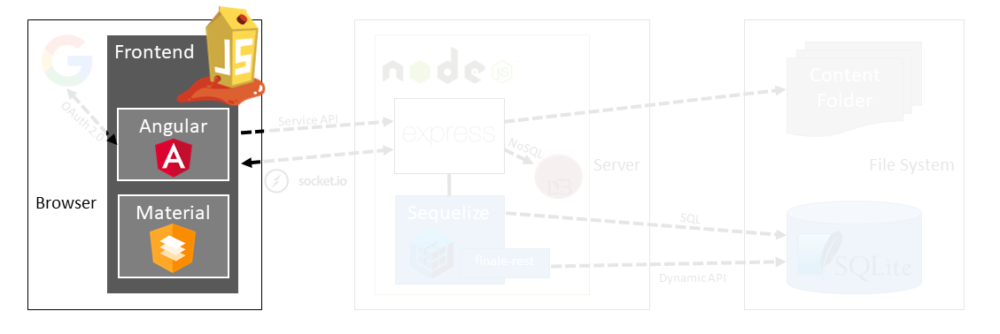
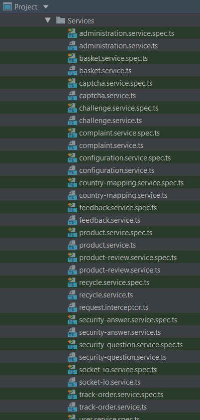
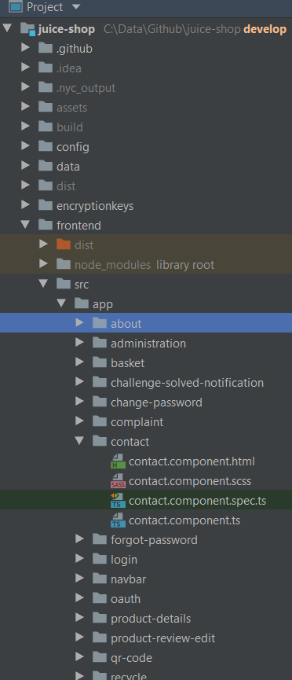
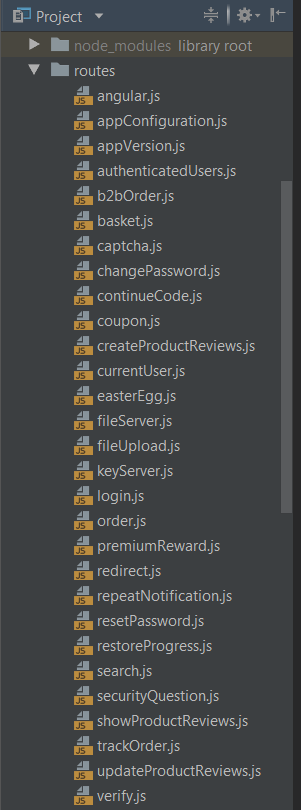
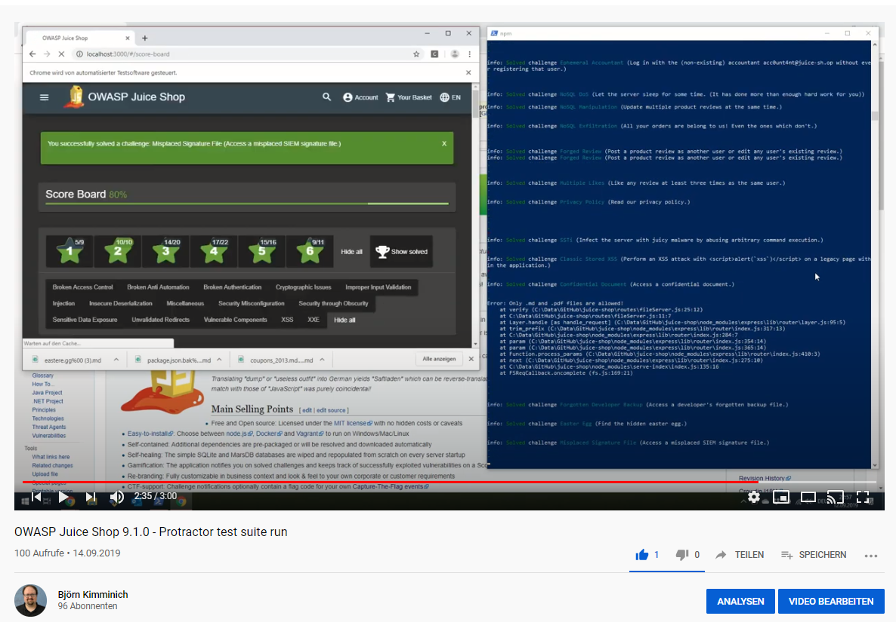

# Codebase 101

Jumping head first into any foreign codebase can cause a little
headache. This section is there to help you find your way through the
code of OWASP Juice Shop. On its top level the Juice Shop codebase is
mainly separated into a client and a server tier, the latter with an
underlying lightweight database and file system as storage.

## Client Tier

OWASP Juice Shop uses the popular [Angular](https://angular.io/)
framework as the core of its client-side. Thanks to
[Angular Material](https://material.angular.io/) - an Angular-specific
implementation of Google's [Material Design](https://material.io/) - the
UI looks nicely familiar and is easy to use. It is also built to be
responsive with the help of
[Angular Flex-Layout](https://github.com/angular/flex-layout), letting
it adapt nicely to different screen sizes. The various icons used
throughout the frontend are from the vast
[Font Awesome 5](https://fontawesome.com/) collection.

ℹ️ Please note that **all client-side code is written in Typescript**
which is compiled into regular JavaScript during the build process.



### Services

> _Service_ is a broad category encompassing any value, function, or
> feature that an app needs. A service is typically a class with a
> narrow, well-defined purpose. It should do something specific and do
> it well.
>
> Angular distinguishes components from services to increase modularity
> and reusability. By separating a component's view-related
> functionality from other kinds of processing, you can make your
> component classes lean and efficient.[^1]

The client-side Angular services reside in the
`frontend/src/app/Services` folder. Each service file handles all
RESTful HTTP calls to the Node.js backend for a specific domain entity
or functional aspect of the application.



Service functions must **always** use Angular's own `HttpClient` to make
any backend calls.

The following code snippet shows how all services in the OWASP Juice
Shop client are structured using the example of `FeedbackService`. It
wraps the `/api/Feedback` API which offers a `GET`, `POST` and `DELETE`
endpoint to find, create and delete `Feedback` of users:

```typescript
import { environment } from '../../environments/environment'
import { Injectable } from '@angular/core'
import { HttpClient } from '@angular/common/http'
import { catchError, map } from 'rxjs/operators'

@Injectable({
  providedIn: 'root'
})
export class FeedbackService {

  private hostServer = environment.hostServer
  private host = this.hostServer + '/api/Feedbacks'

  constructor (private http: HttpClient) { }

  find (params?: any) {
    return this.http.get(this.host + '/' , {
      params: params
    }).pipe(map((response: any) => response.data), catchError((err) => {
      throw err
    }))
  }

  save (params) {
    return this.http.post(this.host + '/', params).pipe(map((response: any) =>
      response.data), catchError((err) => { throw err }))
  }

  del (id) {
    return this.http.delete(this.host + '/' + id).pipe(map((response: any) =>
      response.data), catchError((err) => { throw err }))
  }
}
```

🚨 Unit tests for all services can be found next to their `*.service.ts`
files in the `frontend/src/app/Services` folder as `*.service.spec.ts`
files. They are [Jasmine 2](https://jasmine.github.io) specifications
which are executed by the [Karma](https://karma-runner.github.io) test
runner.

### Components

> A _component_ controls a patch of screen called a _view_.
>
> \[...\]
>
> You define a component's application logic—what it does to support the
> view—inside a class. The class interacts with the view through an API
> of properties and methods.[^2]

The Angular components reside inside `frontend/src/app` as a subfolder
for each individual component. Each component is responsible for one
screen portion of the application. It consists of the component itself
(`*.component.ts`) and the HTML [Template](#templates)
(`*.component.html`) along with its styles (`*.component.scss`).



Components must **always** go through one or more [Services](#services)
when communicating with the application backend.

The code snippet below shows the `ContactComponent` which handles the
_Contact Us_ screen and uses three different services to fulfill its
tasks:
* `UserService` to retrieve data about the currently logged in user (if
  applicable) via the `whoAmi()` function
* `CaptchaService` to retrieve a new CAPTCHA for the user to solve via
  the `getCaptcha()` function
* `FeedbackService` to eventually `save()` the user feedback

☝️ As a universal rule for the entire Juice Shop codebase, unnecessary
code duplication as well as deeply nested 🍝-code should be avoided by
using well-named & small helper functions. This is demonstrated by the
very simple `getNewCaptcha()` and `resetForm()` functions in the code
snippet below. Helper functions should always be located as close to the
calling code as possible.

```typescript
import { FeedbackService } from '../Services/feedback.service'
import { CaptchaService } from '../Services/captcha.service'
import { UserService } from '../Services/user.service'
import { FormControl, Validators } from '@angular/forms'
import { Component, OnInit } from '@angular/core'
import { library, dom } from '@fortawesome/fontawesome-svg-core'
import { faPaperPlane, faStar } from '@fortawesome/free-solid-svg-icons'

library.add(faStar, faPaperPlane)
dom.watch()

@Component({
  selector: 'app-contact',
  templateUrl: './contact.component.html',
  styleUrls: ['./contact.component.scss']
})
export class ContactComponent implements OnInit {

  public authorControl: FormControl =
    new FormControl({ value: '', disabled: true }, [])
  public feedbackControl: FormControl =
    new FormControl('', [Validators.required, Validators.maxLength(160)])
  public captchaControl: FormControl =
    new FormControl('', [Validators.required])
  public userIdControl: FormControl = new FormControl('', [])
  public rating: number = 0
  public feedback: any = undefined
  public captcha: any
  public captchaId: any
  public confirmation: any
  public error: any

  constructor (
    private userService: UserService,
    private captchaService: CaptchaService,
    private feedbackService: FeedbackService) { }

  ngOnInit () {
    this.userService.whoAmI().subscribe((data: any) => {
      this.feedback = {}
      this.userIdControl.setValue(data.id)
      this.feedback.UserId = data.id
      this.authorControl.setValue(data.email || 'anonymous')
    }, (err) => {
      this.feedback = undefined
      console.log(err)
    })
    this.getNewCaptcha()
  }

  getNewCaptcha () {
    this.captchaService.getCaptcha().subscribe((data: any) => {
      this.captcha = data.captcha
      this.captchaId = data.captchaId
    }, (err) => err)
  }

  save () {
    this.feedback.captchaId = this.captchaId
    this.feedback.captcha = this.captchaControl.value
    this.feedback.comment = this.feedbackControl.value
    this.feedback.rating = this.rating
    this.feedback.UserId = this.userIdControl.value
    this.feedbackService.save(this.feedback).subscribe((savedFeedback) => {
      this.error = null
      this.confirmation = 'Thank you for your feedback' +
        (savedFeedback.rating === 5 ? ' and your 5-star rating!' : '.')
      this.feedback = {}
      this.ngOnInit()
      this.resetForm()
    }, (error) => {
      this.error = error.error
      this.confirmation = null
      this.feedback = {}
      this.resetForm()
    })
  }

  resetForm () {
    this.authorControl.markAsUntouched()
    this.authorControl.markAsPristine()
    this.authorControl.setValue('')
    this.feedbackControl.markAsUntouched()
    this.feedbackControl.markAsPristine()
    this.feedbackControl.setValue('')
    this.captchaControl.markAsUntouched()
    this.captchaControl.markAsPristine()
    this.captchaControl.setValue('')
  }

}
```

🚨 Unit tests for all components can be found in their subfolders within
`frontend/src/app/` as `*.component.spec.ts` files. They are
[Jasmine 2](https://jasmine.github.io) specifications which are executed
by the [Karma](https://karma-runner.github.io) test runner.

### Templates

> The Angular application manages what the user sees and can do,
> achieving this through the interaction of a component class instance
> (the _component_) and its user-facing template.
>
> You may be familiar with the component/template duality from your
> experience with model-view-controller (MVC) or model-view-viewmodel
> (MVVM). In Angular, the component plays the part of the
> controller/viewmodel, and the template represents the view.[^3]

Each screen within the application is defined in a HTML view template
along with its [Component](#components) in the subfolders beneath
`frontend/src/app/`. The views are written as HTML using
[Angular Material](https://material.angular.io/) for styling and
[Angular Flex-Layout](https://github.com/angular/flex-layout) for
responsiveness. Furthermore most views incorporate icons from the
[Font Awesome 5](https://fontawesome.com/) collection.

ℹ️ Understanding the
[Declarative HTML APIs of the Angular Layout](https://github.com/angular/flex-layout/wiki/API-Documentation#html-api-declarative)
is crucial to be able to write UI elements or entire screens without
breaking responsiveness!

The following code snippet shows the `contact.component.html` view which
\- together with the previously shown `ContractComponent` class and its
associated styles in `contact.component.scss` - represents the entire
_Contact Us_ screen.



```html
<div fxLayoutAlign="center">
  <mat-card>
    <h3 translate>TITLE_CONTACT</h3>

    <div *ngIf="confirmation">
      <p class="confirmation">{{confirmation}}</p>
    </div>
    <div *ngIf="error">
      <p class="error">{{error}}</p>
    </div>

    <div class="form-container">

      <input hidden type="text" id="userId" [formControl]="userIdControl"/>

      <mat-form-field appearance="outline">
        <mat-label translate>LABEL_AUTHOR</mat-label>
        <input [formControl]="authorControl" matInput type="text">
      </mat-form-field>

      <mat-form-field appearance="outline">
        <mat-label translate>LABEL_COMMENT</mat-label>
        <textarea id="comment" [formControl]="feedbackControl" matInput></textarea>
        <mat-error *ngIf="feedbackControl.invalid && feedbackControl.errors.required" translate>
          MANDATORY_COMMENT
        </mat-error>
      </mat-form-field>

      <div style="margin-top:5px;" class="rating-container">
        <label style="font-weight:bold; margin-right: 8px;" translate>
          LABEL_RATING
        </label>
        <bar-rating [(rate)]="rating" [max]="5"></bar-rating>
      </div>

      <mat-form-field>
        <label style="font-weight:bold;" translate>LABEL_CAPTCHA</label>&nbsp;
        <code id="captcha">{{captcha}}</code>&nbsp;<label>?</label>
        <input id="captchaControl" [formControl]="captchaControl" matInput type="text">
        <mat-error *ngIf="captchaControl.invalid && captchaControl.errors.required" translate>
          MANDATORY_CAPTCHA
        </mat-error>
      </mat-form-field>

    </div>

    <button type="submit" id="submitButton" style="margin-top:5px;"
            mat-raised-button color="primary"
            [disabled]="authorControl.invalid || feedbackControl.invalid || captchaControl.invalid || !rating"
            (click)="save()">
      <i class="fas fa-paper-plane fa-lg"></i> {{'BTN_SUBMIT' | translate}}
    </button>

  </mat-card>
</div>
```



ℹ️ In the entire Juice Shop code base, inline templates are **never**
used. Templates must **always** be described in separate `.html` files.

### Internationalization

All static texts in the user interface are fully internationalized using
the `ngx-translate` module. Texts coming from the server (e.g. product
descriptions or server error messages) are always in English.

No hard-coded texts are allowed in any of the [Templates](#templates) or
[Components](#components). Instead, property keys have to be defined and
are usually applied with a `translate` attribute that can be placed in
most HTML tags. You might have noticed several of these `translate`
attributes in the `contact.component.html` code snippet from the
[Templates](#templates) section.

The different translations are maintained in JSON files in the
`/frontend/src/assets/i18n` folder. The only file that is allowed to be
touched by developers is the `en.json` file for the original English
texts. New properties are exclusively added here. When pushing the
`develop` branch to GitHub, the online translation provider will pick up
changes in `en.json` and adapt all other language files accordingly. All
this happens behind the scenes in a distinct branch `l10n_develop` which
will be manually merged back into `develop` on a regular basis.

To learn about the actual translation process please refer to the
chapter [Helping with translations](translation.md).

### Client-side code compilation

All client side Angular code is compiled into JavaScript and afterwards
_uglified_ (for
[security by obscurity](https://en.wikipedia.org/wiki/Security_through_obscurity))
and _minified_ (for initial load time reduction) during the build
process (launched with `npm install`) of the application. This creates
an `frontend/dist/frontend` folder, which is the one actually delivered
to the Browser to load all application-specific client-side code.

ℹ️ If you want to quickly test client-side code changes, it can be
cumbersome and slow to launch `npm install` over and over again. Instead
you can use `npm run serve` to keep let Angular watch for client-code
changes and recompile the affected parts on the fly. You usually not
even have to manually refresh your browser with `F5` to see your
changes.

## Server Tier

The backend of OWASP Juice Shop is a [Node.js](https://nodejs.org)
application based on the [Express](http://expressjs.com) web framework.
Before `v12.7.0` the backend code base was JavaScript (ES6), but since
then it has been gradually migrated into TypeScript.


### Routes

> Routing refers to determining how an application responds to a client
> request to a particular endpoint, which is a URI (or path) and a
> specific HTTP request method (GET, POST, and so on).
>
> Each route can have one or more handler functions, which are executed
> when the route is matched.[^4]

Routes are defined via the the [Express](http://expressjs.com) framework
and can be handled by any of the following middleware:

* An [automatically generated API endpoint](#generated-api-endpoints)
  for one of the exposed tables from the application's
  [Data model](#data-model)
* A [hand-written middleware](#hand-written-middleware) which
  encapsulates some business or technical responsibility
* Some third-party middleware that fulfills a non-functional requirement
  such as
  * file serving (via `serve-index` and `serve-favicon`)
  * adding HTTP security headers (via `helmet` and `cors`)
  * extracting cookies from HTTP requests (via `cookie-parser`)
  * writing access logs (via `morgan`)
  * catching unhandled exceptions and presenting a default error screen
    (via `errorhandler`)

🚨 Integration tests for all routes can be found in the `test/api`
folder alongside all other API endpoint tests, from where
[Frisby.js](https://www.frisbyjs.com/)/[Jest](https://facebook.github.io/jest/)
assert the functionality of the entire backend on HTTP-request/response
level.

#### Generated API endpoints

Juice Shop uses the
[finale-rest](https://www.npmjs.com/package/finale-rest) middleware to
automatically create REST endpoints for most of its Sequelize models.
For e.g. the `User` model the generated endpoints are:

* `/api/Users` accepting
  * `GET` requests to retrieve all (or a filtered list of) user records
  * and `POST` requests to create a new user record
* `/api/Users/{id}` accepting
  * `GET` requests to retrieve a single user record by its database ID
  * `PATCH` requests to update a user record
  * `DELETE` requests to delete a user record

Apart from the `User` model also the `Product`, `Feedback`,
`BasketItem`, `Challenge`, `Complaint`, `Recycle`, `SecurityQuestion`
and `SecurityAnswer` models are exposed in this fashion.

Not all HTTP verbs are accepted by every endpoint. Furthermore, some
endpoints are protected against anonymous access and can only be used by
an authenticated user. This is described later in section
[Access control on routes](#access-control-on-routes).

```typescript
finale.initialize({
  app,
  sequelize: models.sequelize
})

const autoModels = ['User', 'Product', 'Feedback',
'BasketItem', 'Challenge', 'Complaint', 'Recycle',
'SecurityQuestion', 'SecurityAnswer']

for (const modelName of autoModels) {
  const resource = finale.resource({
    model: models[modelName],
    endpoints: [`/api/${modelName}s`, `/api/${modelName}s/:id`]
  })

  // fix the api difference between finale (fka epilogue) and previously
  // used sequlize-restful
  resource.all.send.before((req, res, context) => {
    context.instance = {
      status: 'success',
      data: context.instance
    }
    return context.continue
  })
}
```

#### Hand-written middleware

The business functionality in the application backend is separated into
tightly scoped middleware components which are placed in the `routes`
folder.



These middleware components are directly mapped to
[Express](http://expressjs.com) routes.

Each middleware exposes a single function which encapsulates their
responsibility. For example, the `angular.ts` middleware delivers the
`index.html` page to the client:

```typescript
const path = require('path')
const utils = require('../lib/utils')

module.exports = function serveAngularClient () {
  return ({url}, res, next) => {
    if (!utils.startsWith(url, '/api') && !utils.startsWith(url, '/rest')) {
      res.sendFile(path.resolve(__dirname, '../app/index.html'))
    } else {
      next(new Error('Unexpected path: ' + url))
    }
  }
}
```

If a hand-written middleware is involved in a hacking challenge, it must
assess on its own if the challenge has been solved. For example, in the
`basket.ts` middleware where successfully accessing another user's
shopping basket is verified:

```typescript
const utils = require('../lib/utils')
const security = require('../lib/security')
const models = require('../models/index')
const challenges = require('../data/datacache').challenges

module.exports = function retrieveBasket () {
  return (req, res, next) => {
    const id = req.params.id
    models.Basket.find({ where: { id }, include: [ { model: models.Product, paranoid: false } ] })
      .then(basket => {
        if (utils.notSolved(challenges.basketChallenge)) {
          const user = security.authenticatedUsers.from(req)
          if (user && id && id !== 'undefined' && user.bid != id) {
            utils.solve(challenges.basketChallenge)
          }
        }
        res.json(utils.queryResultToJson(basket))
      }).catch(error => {
        next(error)
      })
  }
}
```

One particular middleware deviating from above approach is `verify.ts`.
It contains no business functionality. Instead of one function it
exposes several named functions on challenge verification for
[Generated API endpoints](#generated-api-endpoints), for example:

```
app.post('/api/Feedbacks', verify.forgedFeedbackChallenge())
app.post('/api/Feedbacks', verify.captchaBypassChallenge())
```

The same applies for any challenges on top of third-party middleware,
for example:

```
app.use(verify.errorHandlingChallenge())
app.use(errorhandler())
```

Similar to the [Generated API endpoints](#generated-api-endpoints), not
all hand-written endpoints can be used anonymously. The upcoming section
[Access control on routes](#access-control-on-routes) explains the
available authorization checks.

🚨 Unit tests for hand-written routes can be found in the `test/server`
folder. These tests are written using the [Chai](http://chaijs.com/)
assertion library in conjunction with the [Mocha](https://mochajs.org/)
test framework.

#### Access control on routes

For both the generated and hand-written middleware access can be
restricted on the corresponding routes by adding `security.denyAll()`
or `security.isAuthorized()` as an extra middleware. Examples for
denying all access to certain HTTP verbs for the `SecurityQuestion` and
`SecurityAnswer` models:

```typescript
/* SecurityQuestions: Only GET list of questions allowed. */
app.post('/api/SecurityQuestions', security.denyAll())
app.use('/api/SecurityQuestions/:id', security.denyAll())

/* SecurityAnswers: Only POST of answer allowed. */
app.get('/api/SecurityAnswers', security.denyAll())
app.use('/api/SecurityAnswers/:id', security.denyAll())
```

The following snippet show the authorization settings for the `User`
model which allows only `POST` to anonymous users (for registration) and
requires to be logged-in for retrieving the list of users or individual
user records. Deleting users is completely forbidden:

```typescript
app.get('/api/Users', security.isAuthorized())
app.route('/api/Users/:id')
  .get(security.isAuthorized())
  .put(security.denyAll()) // Updating users is forbidden to make the password change challenge harder
  .delete(security.denyAll()) // Deleting users is forbidden entirely to keep login challenges solvable
```

### Custom libraries

Two important and widely used custom libraries reside in the `lib`
folder, one containing useful utilities (`lib/utils.ts`) and the other
encapsulating many of the broken security features (`lib/insecurity.js`)
of the application.

#### Useful utilities

The main responsibility of the `utils.ts` module is setting challenges
as solved and sending associated notifications, optionally including a
CTF flag code. It can also retrieve any challenge by its name and check
if a passed challenge is not yet solved, to avoid unnecessary (and
sometimes expensive) repetitive solving of the same challenge.

```typescript
exports.solve = function (challenge, isRestore) {
  const self = this
  challenge.solved = true
  challenge.save().then(solvedChallenge => {
    solvedChallenge.description = entities.decode(sanitizeHtml(solvedChallenge.description, {
      allowedTags: [],
      allowedAttributes: []
    }))
    console.log(colors.green('Solved') + ' challenge ' + colors.cyan(solvedChallenge.name) + ' (' + solvedChallenge.description + ')')
    self.sendNotification(solvedChallenge, isRestore)
  })
}

exports.sendNotification = function (challenge, isRestore) {
  if (!this.notSolved(challenge)) {
    const flag = this.ctfFlag(challenge.name)
    const notification = {
      name: challenge.name,
      challenge: challenge.name + ' (' + challenge.description + ')',
      flag: flag,
      hidden: !config.get('application.showChallengeSolvedNotifications'),
      isRestore: isRestore
    }
    notifications.push(notification)
    if (global.io) {
      global.io.emit('challenge solved', notification)
    }
  }
}
```

It also offers some basic `String` and `Date` utilities along with data
(un-)wrapper functions and a method for the synchronous file download
used during [Customization](../part1/customization.md).

#### security features

The `insecurity.js` module offers all security-relevant utilities of the
application, but of course mostly in some broken or flawed way:

* Hashing functions both weak (`hash()`) and relatively strong
  (`hmac()`)
* [Route](#routes) authorization via JWT with `denyAll()` and
  `isAuthorized()` (see
  [Access control on routes](#access-control-on-routes)) and
  corresponding grant of permission for a users with `authorize()`
* HTML sanitization by exposing a (vulnerable) external library as
  function `sanitizeHtml()`
* Keeping a bi-directional map of users with their current
  authentication token (JWT) in `authenticatedUsers`
* Coupon code creation and verification functions `generateCoupon()` and
  `discountFromCoupon()`
* A allowlist of allowed redirect URLs and a corresponding check
  function `isRedirectAllowed()`
* CAPTCHA verification via `verifyCaptcha()` which compares the user's
  answer against the requested CAPTCHA from the database

## Storage Tier

[SQLite](https://www.sqlite.org) and
[MarsDB](https://github.com/c58/marsdb) form the backbone of the Juice
Shop, as an e-commerce application without storage for its product,
customer and associated data would not be very realistic. The Juice Shop
uses light-weight implementations on the database layer to keep it
runnable as a single "all-inclusive" server which
[can be deployed in various ways](../part1/running.md#run-options) with
ease.


### Database

For the main database of the Juice Shop the file-based
[SQLite](https://www.sqlite.org) engine is used. It does not require a
separate server but is accessed directly from `data/juiceshop.sqlite` on
the file system of the Node.js server. For ease of use and more
flexibility the relational mapping framework
[Sequelize](http://docs.sequelizejs.com) is used to actually access the
data through a querying API. Sometime plain SQL is used as well, and of
course in an unsafe way that allows [Injection](../part2/injection.md).

#### Data model

The relational data model of the Juice Shop is very straightforward. It
features the following tables:

* `Users` which contains all registered users (i.e. potential customers)
  of the web shop.
* The table `SecurityQuestions` contains a fixed number of security
  questions a user has to choose from during registration. The provided
  answer is stored in the table `SecurityAnswers`.
* The `Products` table contains the products available in the shop
  including price data.
* When logging in every user receives a shopping basket represented by a
  row in the `Baskets` table. When putting products into the basket this
  is reflected by entries in `BasketItems` linking a product to a basket
  together with a quantity.
* Users can interact further with the shop by
  * giving feedback which is stored in the `Feedbacks` table
  * complaining about recent orders which creates entries in the
    `Complaints` table
  * asking for fruit-pressing leftovers to be collected for recycled via
    the `Recycles` table.
* The table `Captchas` stores all generated CAPTCHA questions and
  answers for comparison with the users response.
* The `Challenges` table would not be part of the data model of a normal
  e-commerce application, but for simplicities sake it is kept in the
  same schema. This table stores all hacking challenges that the OWASP
  Juice Shop offers and persists if the user already solved them or not.


### Non-relational database

Not all data of the Juice Shop resides in a relational schema. The
product `reviews` are stored in a non-relational in-memory
[MarsDB](https://github.com/c58/marsdb) instance. An example user
`reviews` entry might look like the following inside MarsDB:

```
{"message":"One of my favorites!","author":"admin@juice-sh.op","product":1,"_id":"PaZjAKKMaxWieSF65"}
```

All interaction with MarsDB happens via the MongoDB query syntax.

### Populating the databases

The OWASP Juice Shop comes with a `data/datacreator.ts` module that is
automatically executed on every server start after the SQLite file and
in-memory MarsDB have been cleared. It populates all tables with some
initial data which makes the application usable out-of-the-box:

```typescript
module.exports = async () => {
  const creators = [
    createUsers,
    createChallenges,
    createRandomFakeUsers,
    createProducts,
    createBaskets,
    createBasketItems,
    createFeedback,
    createComplaints,
    createRecycles,
    createSecurityQuestions,
    createSecurityAnswers
  ]

  for (const creator of creators) {
    await creator()
  }
}
```

For the `Users` and `Challenges` tables the rows to be inserted are
defined via YAML files in the `data/static` folder. As the contents of
the `Products` table and the non-relational `reviews` collection
[can be customized](../part1/customization.md), it is populated based on
the active configuration file. By default this is `config/default.yml`).

The data in the `Feedbacks`, `SecurityQuestions`, `SecurityAnswers`,
`Basket`, `BasketItem`, `Complaints` and `Recycles` tables is statically
defined within the `datacreator.ts` script. They are so simple that a
YAML declaration file seemed like overkill.

The `Captchas` table remains empty on startup, as it will dynamically
generate a new CAPTCHA every time the _Contact us_ page is visited.

### File system

The folder `ftp` contains some files which are directly accessible. When
a user completes a purchase, an order confirmation PDF is generated and
placed into this folder. Other than that the `ftp` folder is also used
to deliver the shop's terms of use to interested customers.

#### Uploaded complaint files

The _File complaint_ page contains a file upload field to attach one of
the previously mentioned order confirmation PDFs. While these are really
uploaded to the server, they are _not written_ to the file system but
discarded for security reasons: Publicly hosted Juice Shop instances are
not supposed to be abused as malware distribution sites or file shares.

## End-to-end tests

> As applications grow in size and complexity, it becomes unrealistic to
> rely on manual testing to verify the correctness of new features,
> catch bugs and notice regressions. Unit tests are the first line of
> defense for catching bugs, but sometimes issues come up with
> integration between components which can't be captured in a unit test.
> End-to-end tests are made to find these problems.[^5]

The folder `test/e2e` contains an extensive suite of end-to-end tests
which **automatically solves _every_ challenge** in the Juice Shop
application. Whenever a new challenge is added, a corresponding
end-to-end test needs to be included, to prove that it can be exploited.

It is quite an impressive sight to see how
{{book.juiceShopNumberOfChallenges}} hacking challenges are solved
without any human interaction in a few minutes. The e2e tests constantly
jump back and forth between attacked pages and the
[Score Board](../part1/challenges.md#the-score-board) letting you watch
as the difficulty stars and progress bar slowly fill and ever more green
"solved"-badges appear. There is a
[video recording of this on YouTube](https://youtu.be/9LkWOWiLZoc) for
the 9.1.0 release of the Juice Shop.

[](https://youtu.be/9LkWOWiLZoc)

These tests are written and executed with
[Protractor](https://www.protractortest.org) which uses
[Selenium WebDriver](https://www.seleniumhq.org/projects/webdriver/)
under the hood.

[^1]: https://angular.io/guide/architecture-services

[^2]: https://angular.io/guide/architecture-components

[^3]: https://angular.io/guide/template-syntax

[^4]: http://expressjs.com/en/starter/basic-routing.html

[^5]: https://docs.angularjs.org/guide/e2e-testing

